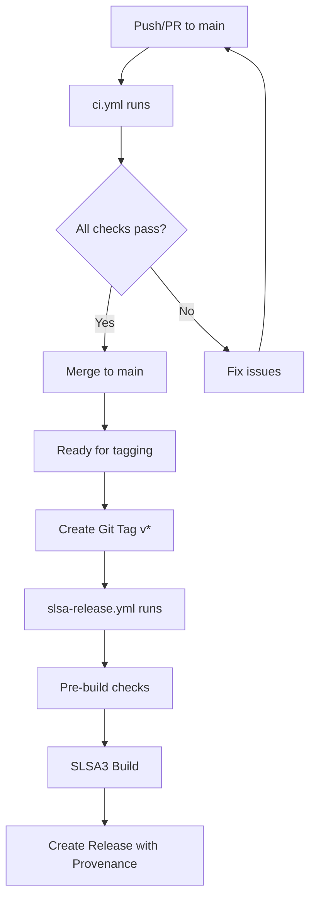

# GitHub Actions Workflows

This project uses multiple GitHub Actions workflows for different purposes:

## 🔄 Continuous Integration - `ci.yml`

**Triggers:** Every push and pull request to `main` and `develop` branches

**Purpose:** Quality assurance and testing

**Jobs:**
- **Lint** - Code formatting and linting checks
- **Test** - Run tests on multiple Go versions (1.21, 1.22, 1.23)
- **Build** - Verify the project builds correctly
- **Docker** - Build and test Docker images
- **Security** - Security vulnerability scanning
- **Dependency Review** - Check for security issues in dependencies (PRs only)

## 🚀 Secure Release - `slsa-release.yml`

**Triggers:**
- Manual dispatch
- Release created
- Tags pushed (v*)

**Purpose:** SLSA3-compliant secure releases with provenance

**Jobs:**
- **Pre-build Checks** - Run quality checks before building
- **SLSA3 Build** - Secure, reproducible builds with provenance
- **Upload Provenance** - Attach security metadata to releases

## 📋 Workflow Relationship



## 🔧 Configuration Files

- **`.golangci.yml`** - Linting and formatting rules
- **`.slsa-goreleaser.yml`** - SLSA build configuration
- **`Makefile`** - Local development commands

## 🏃‍♂️ Development Workflow

1. **Development**: Work on features, CI runs on every push
2. **Quality Gates**: All CI checks must pass before merge
3. **Release**: Create git tag to trigger secure SLSA release
4. **Verification**: Use SLSA verifier to check release provenance

## 📝 Release Process

### Automated Release with SLSA3

1. Ensure all CI checks pass on main branch
2. Create and push a git tag:
   ```bash
   git tag -a v1.0.0 -m "Release v1.0.0"
   git push origin v1.0.0
   ```
3. SLSA workflow automatically:
   - Runs pre-build quality checks
   - Builds binaries for multiple platforms
   - Generates cryptographic provenance
   - Creates GitHub release with assets
   - Attaches provenance metadata

### Manual Release (if needed)

You can also trigger the SLSA release manually:
1. Go to Actions tab in GitHub
2. Select "SLSA Go Releaser" workflow
3. Click "Run workflow"
4. Choose branch and run

## 🔐 Security Features

- **SLSA Level 3**: Highest level of supply chain security
- **Provenance Generation**: Cryptographic proof of build process
- **Reproducible Builds**: Same source = same binary
- **Signed Artifacts**: Tamper-evident releases
- **Dependency Scanning**: Automatic vulnerability detection

## 🛠️ Local Development

Use the Makefile for local development:

```bash
# Setup tools
make install-tools

# Development cycle
make dev              # format + lint + test
make quick           # format-check + lint

# Docker workflow
make build           # Build Docker image
make run             # Run container
make logs            # View logs

# Formatting with golangci-lint v2.4.0
make format          # Format all files
make format-check    # Check formatting
```

## 📊 Workflow Status

Monitor workflow status:
- ✅ **CI Badge**: Shows if main branch is healthy
- 🚀 **Release Badge**: Shows latest release version
- 🔐 **SLSA Badge**: Shows supply chain security level

## 🔗 Useful Links

- [SLSA Framework](https://slsa.dev/)
- [SLSA GitHub Generator](https://github.com/slsa-framework/slsa-github-generator)
- [SLSA Verifier](https://github.com/slsa-framework/slsa-verifier)
- [golangci-lint Documentation](https://golangci-lint.run/)
